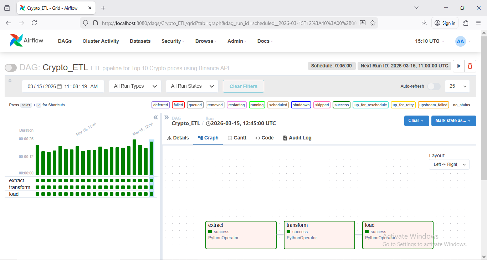
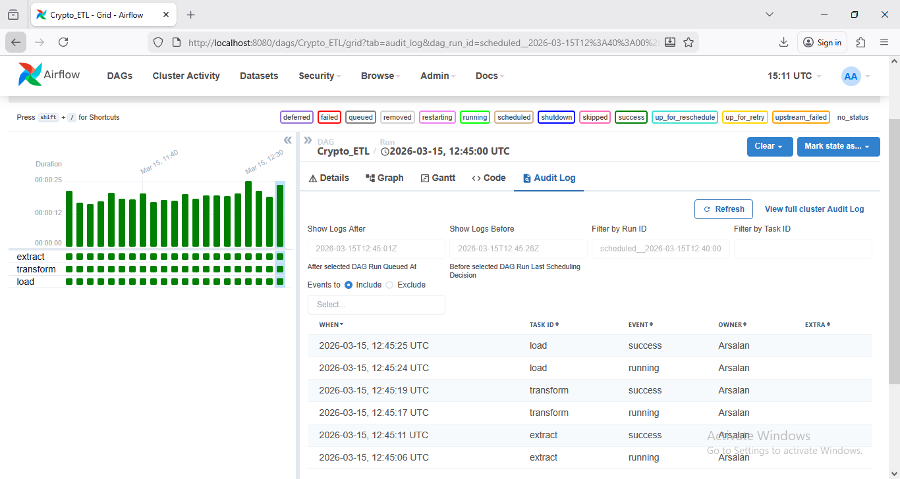

Crypto ETL Pipeline using Apache Airflow

  Overview

This project presents an automated ETL (Extract, Transform, Load) pipeline developed using Apache Airflow to collect real-time cryptocurrency market data from the Binance Public REST API. The pipeline retrieves market statistics for the top ten cryptocurrencies at regular intervals, applies data transformation and feature engineering, and stores the processed data in CSV and JSON formats for further analysis.

The project demonstrates the practical use of Apache Airflow for workflow scheduling, task dependency management, XCom communication, logging, retry mechanisms, and automated data processing.


  Features

- Automated ETL workflow using Apache Airflow
- Real-time cryptocurrency market data collection
- Integration with Binance Public REST API
- Scheduled execution every five minutes
- Data validation and cleaning
- Feature engineering for market analysis
- CSV and JSON data storage
- Error handling with automatic retries
- Task communication using Airflow XCom
- Execution monitoring through the Airflow Web Interface

---

  ETL Workflow

```
Binance Public API
        │
        ▼
   Extract Task
        │
        ▼
  Transform Task
        │
        ▼
     Load Task
        │
        ▼
 CSV & JSON Output
```

---

Pipeline Description

  Extract

The extract task collects 24-hour market statistics for the following cryptocurrencies:

- Bitcoin (BTC)
- Ethereum (ETH)
- Binance Coin (BNB)
- Solana (SOL)
- XRP
- Dogecoin (DOGE)
- Cardano (ADA)
- Avalanche (AVAX)
- Shiba Inu (SHIB)
- Polkadot (DOT)

  The retrieved information includes:

- Current Price
- Open Price
- High Price
- Low Price
- Previous Close Price
- Price Change
- Percentage Change
- Trading Volume
- Quote Volume
- Number of Trades
- Weighted Average Price

---

Transform

The transformation stage performs several preprocessing operations before storing the data.

Data Type Conversion

Converts numeric values returned by the API into appropriate Python data types.

  Data Cleaning

- Removes invalid records
- Handles missing values
- Standardizes decimal precision
- Cleans inconsistent data

  Data Filtering

Records with missing or zero prices are excluded.

  Feature Engineering

Additional analytical features generated include:

- Price Range
- Volatility Percentage
- Trade Intensity
- VWAP Deviation
- Volatility Label
- Market Signal

---

  Load

The processed records are stored in both CSV and JSON formats.

Each successful execution appends new records, allowing the dataset to grow over time for historical analysis.

---

Technologies Used

- Python 3
- Apache Airflow
- Binance Public REST API
- Requests
- JSON
- CSV
- Pandas
- PythonOperator
- XCom
- Logging

---

Project Structure

```
Crypto-ETL-Pipeline-Airflow/
│
├── crypto_etl_dag.py
├── Crypto_ETL_Report.pdf
├── output/
│   ├── crypto_data.csv
│   └── crypto_data.json
├── screenshots/
│   ├── Graph.PNG
│   └── Logs.PNG
└── README.md
```

---

Installation

Clone the repository:

```bash
git clone https://github.com/ahmedarsalanmsained-pixel/Crypto-ETL-Pipeline-Airflow.git
```

Install the required dependencies:

```bash
pip install apache-airflow pandas requests
```

Copy the DAG file to your Airflow DAGs directory and start the Airflow scheduler and web server.

---

## Output

The pipeline generates the following output files:

- `crypto_data.csv`
- `crypto_data.json`

Each execution appends the latest processed cryptocurrency data to these files.

---

  Engineered Features

| Feature | Description |
|----------|-------------|
| Price Range | Difference between daily high and low prices |
| Volatility Percentage | Daily price volatility percentage |
| Trade Intensity | Average trade value |
| VWAP Deviation | Difference between market price and weighted average price |
| Volatility Label | Low, Medium, High, or Extreme |
| Market Signal | Strong Buy, Buy, Sell, or Strong Sell |

---

  Airflow Monitoring

The workflow can be monitored through the Apache Airflow Web Interface.

Available monitoring views include:

- Graph View
- Grid View
- Task Logs
- DAG Run History

---

Project Report

A detailed project report explaining the system architecture, ETL workflow, Airflow DAG design, data transformation process, feature engineering, monitoring, and output analysis is included in this repository.

---

Future Improvements

Possible extensions of this project include:

- PostgreSQL or MySQL integration
- Docker containerization
- Apache Kafka streaming
- Apache Spark processing
- Interactive analytics dashboard
- Email notifications
- Machine learning-based cryptocurrency price prediction
- Cloud deployment on AWS, Azure, or Google Cloud


-## Airflow Screenshots

### DAG Graph View



### Task Execution Logs


---

Author

Ahmed Arsalan Malik

Master of Science in Artificial Intelligence

NED University of Engineering & Technology
